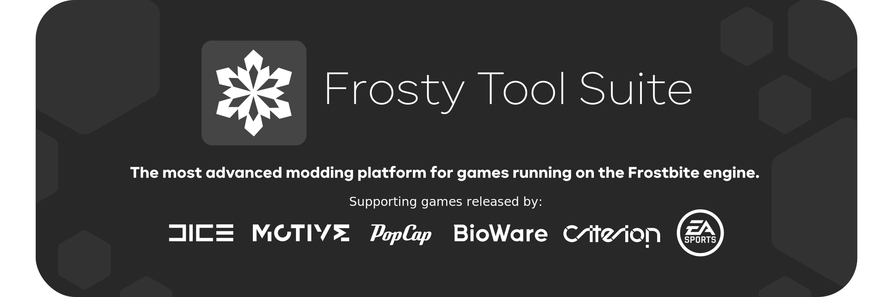

  
  <a href="https://frostytoolsuite.com/">
    <h1 align="center">
      <picture>
        
      </picture>
    </h1>
  </a>

  
  

## Development
This is a rewrite of the FrostyToolsuite in .NET 7, which is in very early development.

It aims to clean up the code base and use [Avalonia UI](https://github.com/AvaloniaUI/Avalonia) with The [MVVM Community Toolkit](https://aka.ms/mvvmtoolkit/docs) instead of WPF.
Another reason for the rewrite is to completely seperated the 2 core libraries FrostySdk and FrostyModSupport from the ModManager and Editor.

## Documentation
Todo

## Contributing
If you want to contribute to Frosty you can just fork this branch and make a pull request with your changes.
Before you do that please check the [CodingStandards.cs](https://github.com/CadeEvs/FrostyToolsuite/blob/2.0.0/CodingStandards.cs) to check if your code follows those.
In the [Projects tab](https://github.com/users/CadeEvs/projects/1) you can see what needs to be done, ideas of what can be done and stuff that is currently getting worked on or is already done.
If you decide to work on something it would be great if you could say that in the [#developer](https://discord.com/channels/333086156478480384/840965412106928188) channel on the discord server.
